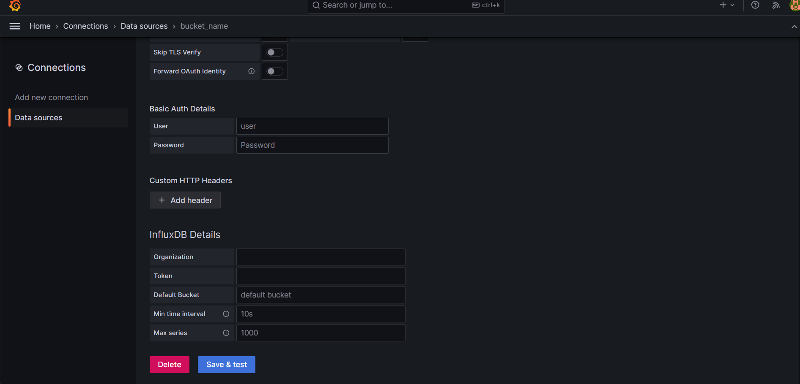

## Weather Dashboard with BME280 readings and MING Stack.

This project involves working with ESP32-C3 Xiao and a BME280 sensor to collect temperature, humidity, and pressure data. 

Once the readings are obtained, we will utilize an MQTT (MQTTX) broker to publish the data, with Node-RED acting as a subscriber to receive the sensor values.

Upon receiving the values, Node-RED will store the data in InfluxDB, as it is a real-time database that performs optimally with time-based readings.

F
Finally, assuming all is functioning correctly, we can connect our InfluxDB with Grafana to visualize our data in real-time.

### ESP32 and BME280 code. 

The code was written in C using VScode with the IDF plugin framework from Espressif. 

-*main* folder contains the **main.c** file, which includes all the code necessary to connect the BME280 sensor, establish a WiFi connection, and publish data to MQTT server topics.

-*components* folder contains the code for the BME280 sensor. This code is provided by Bosch and consists of 3 files **bme280.h**, **bme280.c** and **bme280_support.c**.
 
### MQTT broker 

The broker used in this proyect was MQTTX. After downloading and installing it on your computer, you need to set up the connections to obtain the broker address and establish connections in the **main.c** file

With these parameters, you can establish connections with the broker using an address in the following format:

    ws://broker.emqx.io:1083/mqttgit

The next step is to add the topics that we want to subscribe to. These topics should match the setup topics in the main.c file.

Once you set up the connections and flash your device with the code, you should see something like this in MQTTX:
 

These are the topics that we created and published data from the BME280.

### Node-Red 
Now that we have our MQTT broker running, we can set up Node-RED as a subscriber to receive all the readings from our sensor. Additionally, we will connect Node-RED to an installed and configured InfluxDB.

Node-RED functions as a workflow tool primarily used for IoT. You will work with modules called 'nodes', which are equivalent to 'processors' in Nifi.

The nodes utilized in Node-RED were "mqtt in", "influxdb out", and "debug". Note that the "influxdb out" node is not installed by default, so you'll need to install it separately.

For the "mqtt in" node, you need to configure the following parameters:

*server*: broker direction

*topic*: topic that you want to suscribe

And for "influxdb out":

*organization*: organization configurated in you influxdb

*bucket*: name of your bucket

*measurement*: a name for the measurement, in this case I used the same as the topics.

*server*: in server you will have some parameter to setup:
 

*name*: a name for you server configuration
*version*: the version of your influxdb

*url*: the direction of you db

*token*: the key that you got once you setup influxdb

If set up correctly, you will observe your sensor readings appearing in the debug area, and you'll find them inside your designated bucket in InfluxDB.

In InfluxDB, you should see the data and measurements that you used in Node-RED, which in my case correspond to the same topics as in MQTTX.

Finally, if the data is being recorded as expected, you can configure Grafana to create a visually appealing dashboard.

Once you have installed Grafana, you need to add a data source and select the type of database you are using. You will see many options, but in this case, we want to use InfluxDB.

To set up the database in Grafana, you should provide a name for your bucket, select a query language according to the version of InfluxDB you are using (for example, Flux for InfluxDB 2 and 3 or SQL for InfluxDB 3), and specify the URL of your database.

Lastly, you will need to add the user, password, organization, and token from InfluxDB to complete the setup options in Grafana. After configuring these settings, you can start creating your dashboard.

This is a dashboard example:

